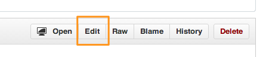

# WAI Tutorials

This is the repository for the WAI tutorials, see [current draft][LivePage].

You can find the current draft state of the document on [this Github Pages site][GHPage]

## How to contribute

The tutorials use [Middleman][] to create static HTML files. However there is no need to get into installing Middleman on your computer if you want to contribute. The complete content is organized in Markdown files that you can edit using the edit button in the top right corner of the file’s detail page, if you’re logged into Github. [Here’s an example in the Images Tutorial.][exmpImg]



You can start editing right away. We use the standard Markdown syntax. If you get the following note, this is expected behavior:

> You are editing a file in a project you do not have write access to. We are forking this project for you (if one does not yet exist) to write your proposed changes to. Submitting a change to this file will write it to a new branch in your fork so you can send a pull request.

It is technical for “All right, make your edits, we make sure you can send them in as a proposal!” 

Don’t forget to add some descriptive text at the bottom that comments your change. Try to be concise. Klick the “Propose this change” button to continue. Then you get another comment field, you can write down your motivation for the change here. Once you click “Send pull request” the editor of the notified of your proposal and may adopt it.

Note that the changes are not immediately reflected on any page. If you want to see your changes in HTML that way is more technical and is described briefly in the following part of the document. As we’re only editing simple Markdown, a preview isn’t needed in most cases.

### Local development

Please follow the [installation instructions on the Midleman web site][MMInst]. Windows users need to [install Ruby first][WinRuby].

Also it is required to install the [Middleman-GH-Pages gem][MMGHP], if you want to push your changes to a github pages branch. You can edit content and work on the files locally without this gem also.


Once you’ve cloned the repository to your computer, using the command line or a git client like [Sourcetree][], running the command `gem install` in the repository directory _should_ set everything up for you.

Try to run `middleman server` from the command line and you should see the following output:

```bash
$ middleman server
== The Middleman is loading
== LiveReload is waiting for a browser to connect
== The Middleman is standing watch at http://0.0.0.0:4567
== Inspect your site configuration at http://0.0.0.0:4567/__middleman/
```

You can now go to the displayed URL (in this example `http://0.0.0.0:4567`) to see the website running in your browser. Every change you make will be reflected in the browser in an instant, due to LiveReload.

Once you’re done, press `ctrl` + `C` on your command line to quit the process.

### Committing to the repository

Try to be very granular about commits to your local repository. For example a commit with the text “Changed all things in the images tutorials.” is quire vague, use something like “Fixed typo on page …”, “Headline text more clear on page …” or “Provide a better example for …” and split it into multiple commits.

_Note: Some git clients like Github for Mac or Sourcetree allow to commit lines of files individually. So make your changes at once but commit them individually._

When you’re done with changes, `git push` them to this repository (`dev` branch) if you have the right to write to the repository or make [a pull request][pullreq].

### Updating github pages

Use the `rake publish` command to publish your current version automatically. If you do that to a forked repository, don’t open pull requests for changes in that branch.

[LivePage]:http://www.w3.org/WAI/tutorials/
[GHPage]:http://w3c.github.io/wai-tutorials/
[Middleman]:http://middlemanapp.com/
[MMInst]:http://middlemanapp.com/basics/getting-started/
[WinRuby]:http://rubyinstaller.org/
[MMGHP]:https://github.com/neo/middleman-gh-pages
[Sourcetree]:http://www.sourcetreeapp.com/
[pullreq]:https://help.github.com/articles/using-pull-requests
[exmpIMG]:https://github.com/w3c/wai-tutorials/blob/master/source/images/informative.html.md.erb
