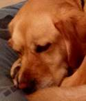

Decorative images are those that do not add information, for example because the information provided by the image is already provided by adjacent text or because the image is included for visual interest only. In these cases, a null (empty) `alt` text needs to be provided (`alt=""`) so that they can be ignored by assistive technologies such as screen readers. This is because text values used for this type of image would add audible clutter to the screen reader output, or could distract users if the topic is different from that in adjacent text.

If the `alt` attribute is not included (even though empty) some screen readers will announce the image's file name. Whether to treat an image as decorative or [informative](informative.html) is a judgement that only the author can make, based on the reason for including the image on the page. Images may be decorative when they are:

-   Visual styling such as borders, spacers, and corners
-   Supplementary to link text to improve its appearance or increase the clickable area
-   Illustrative of adjacent text but do not contribute information (“eye-candy”)
-   Identified and described by surrounding text

{::nomarkdown}
<%= notes_start %>
{:/nomarkdown}

**Note:** Where possible decorative images should be part of the CSS
styling rather than being in the HTML.

{::nomarkdown}
<%= notes_end %>
{:/nomarkdown}

## Image used as part of page design
{:.ex}

This image is used as a border in the page design and has a purely
decorative purpose.

{::nomarkdown}
<%= sample_start %>
{:/nomarkdown}

{::nomarkdown}
<%= sample_end %>
{:/nomarkdown}

{::nomarkdown}
<%= code_start %>
{:/nomarkdown}

~~~ html

~~~

{::nomarkdown}
<%= code_end %>
{:/nomarkdown}

Screen readers also allow the use of WAI-ARIA to hide elements by using `role="presentation"`. Note that this feature is not as widely supported as using a null `alt` attribute.

{::nomarkdown}
<%= code_start %>
{:/nomarkdown}

~~~ html

~~~

{::nomarkdown}
<%= code_end %>
{:/nomarkdown}

## Decorative image as part of a text link
{:.ex}

This illustration of a crocus bulb is used to make the link easier to
identify and to increase the clickable area, but does not add to the
information given in adjacent link text.

{::nomarkdown}
<%= sample_start %>
{:/nomarkdown}

[{:style="vertical-align: middle; margin-right: 1em;"}**Crocus bulbs**](../beyond.html)

{::nomarkdown}
<%= sample_end %>
{:/nomarkdown}

{::nomarkdown}
<%= code_start %>
{:/nomarkdown}

~~~ html
<a href="crocuspage.html">
	
	<strong> Crocus bulbs</strong>
</a>
~~~

{::nomarkdown}
<%= code_end %>
{:/nomarkdown}

{::nomarkdown}
<%= notes_start %>
{:/nomarkdown}

**Note:** The null or empty `alt` value can only be used on linked images
if the image and text are part of a single link anchor and the image
does not add visual information to the link.

{::nomarkdown}
<%= notes_end %>
{:/nomarkdown}

## Image with adjacent text alternative
{:.ex}

This picture of “Poppy the guide dog” is already identified by the
adjacent caption, this acts as the text alternative, which does not need
to be repeated in the `alt` attribute.

 <%= sample_start %>

{:style="float:left; margin-right: 1em;"} **Let sleeping dogs lie:** A proverb meaning
&quot;don't initiate trouble, if something that could be troublesome is quiet,
then leave it alone&quot;.

{::nomarkdown}
<%= sample_end %>
{:/nomarkdown}

{::nomarkdown}
<%= code_start %>
{:/nomarkdown}

~~~ html

	
	<strong>Let sleeping dogs lie:</strong> ...

~~~

{::nomarkdown}
<%= code_end %>
{:/nomarkdown}

## Image used for ambience (eye-candy)
{:.ex}

This image is used to add ambience or visual interest to the page.

{::nomarkdown}
<%= sample_start %>
{:/nomarkdown}

{:style="float:left; margin-right: 1em;"} Don't miss the impressive Tropical House, which is a
huge greenhouse building that displays examples of exotic plant-life
from every tropical environment on the planet.

{::nomarkdown}
<%= sample_end %>
{:/nomarkdown}

{::nomarkdown}
<%= code_start %>
{:/nomarkdown}

~~~ html

~~~

{::nomarkdown}
<%= code_end %>
{:/nomarkdown}

{::nomarkdown}
<%= notes_start %>
{:/nomarkdown}

**Note:** If the purpose of this image was to identify a plant, or
convey other information , rather than only to improve the look of the
page, it should probably be treated as [informative](informative.html). The
purpose for using the image needs to be determined by the author.

{::nomarkdown}
<%= notes_end %>
{:/nomarkdown}

## Related WCAG2.0 Technique:

-   [H67: Using null alt text and no title attribute on img elements for images that AT should ignore](http://www.w3.org/TR/2012/NOTE-WCAG20-TECHS-20120103/H67)
-   [H2: Combining adjacent image and text links for the same resource.](http://www.w3.org/TR/2012/NOTE-WCAG20-TECHS-20120103/H2)
